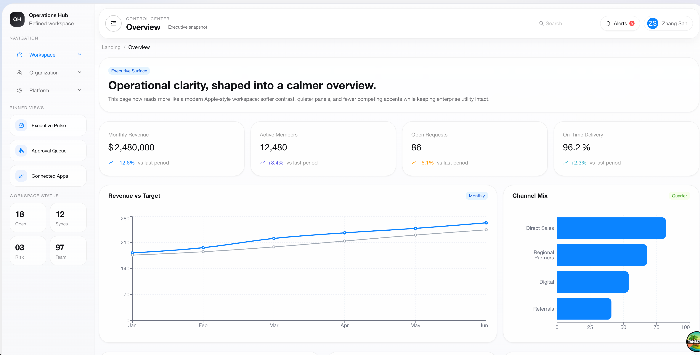
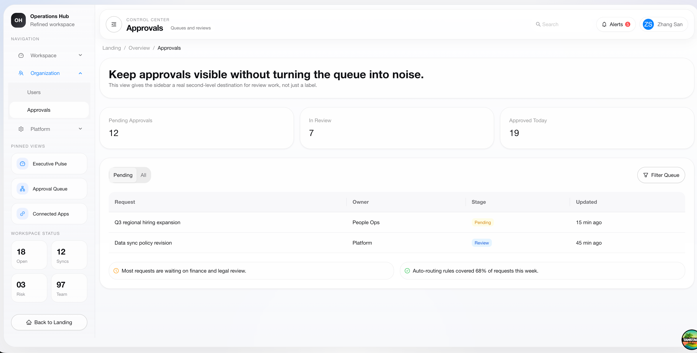
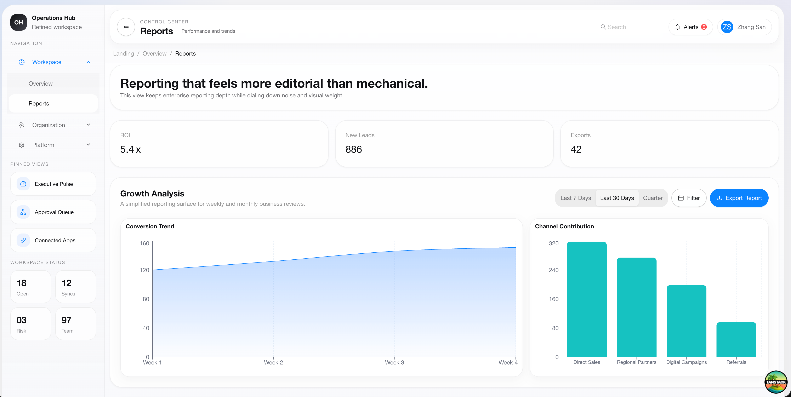

# TanStack Ship Operations Hub


[Official Site](https://tanstackship.com/) • [Templates](https://tanstackship.com/templates) • [Pricing](https://tanstackship.com/pricing) • [Docs](https://tanstackship.com/docs)

TanStack Ship Operations Hub is a polished admin dashboard template for teams that need a modern TanStack foundation for internal tools, reporting surfaces, operational back offices, and business control panels. It combines TanStack Start, file-based routing, React 19, Ant Design, and Recharts into a dashboard shell that already includes overview, approvals, reports, users, integrations, and settings surfaces.

The template is optimized for local iteration with Vite and deployment to Cloudflare Workers, making it suitable both as a production starter and as a reusable dashboard asset inside the broader TanStack Ship template catalog.

If your brand is TanStack Ship, this repository should read as one concrete template offering: a common admin dashboard developers can fork, extend, and ship quickly.

## A TanStack Ship Template

TanStack Ship is the parent brand for your TanStack-focused templates, boilerplates, and starter kits. This repository represents the admin dashboard template in that lineup, so the README should position it as a productized starting point rather than a generic demo.

- Use this repo when you want a common management dashboard that already has solid information architecture and UI scaffolding.
- Use TanStack Ship as the main brand destination where developers can discover your broader catalog of TanStack templates.
- Treat this project as the admin template SKU in that catalog, not as an isolated standalone experiment.

## Template Positioning

This template is best suited for:

- Admin dashboards for SaaS products
- Internal operations workspaces
- Reporting and analytics consoles
- Approval and workflow management panels
- Team, access, and integration management surfaces

## Preview

### Overview



### Approvals



### Reports



## Why This Template Exists

- Provide a reusable admin dashboard template instead of a minimal starter.
- Demonstrate TanStack Router file-based routing in a multi-view admin surface.
- Show how Ant Design can be reshaped into a softer, more productized visual system.
- Offer a Cloudflare-ready frontend workflow using the Vite plugin and Wrangler.
- Keep the code small enough to fork, understand, and extend quickly.

## Technical Highlights

- React 19 application runtime with TypeScript-first development.
- TanStack Start application shell with TanStack Router file-based routes.
- Ant Design components themed through a central ConfigProvider setup.
- Recharts-based analytics widgets for trend and channel reporting.
- Tailwind CSS v4 available for utility styling alongside custom CSS.
- Vite-powered local development and production builds.
- Cloudflare Workers deployment path through Wrangler.
- ESLint, Prettier, and Vitest already wired into the project scripts.

## Route Surface

The dashboard is organized as a small but useful operations workspace:

| Route                   | Purpose                                                          |
| ----------------------- | ---------------------------------------------------------------- |
| /                       | Landing page entry point                                         |
| /dashboard              | Executive overview with KPIs, pipeline health, and activity      |
| /dashboard/approvals    | Approval queue with segmented filtering and summary cards        |
| /dashboard/reports      | Reporting workspace with charts, ROI metrics, and export actions |
| /dashboard/users        | Team and access management surface                               |
| /dashboard/integrations | Connected services and platform integrations                     |
| /dashboard/settings     | System and workspace preferences                                 |

## Stack

| Layer                  | Choice                         |
| ---------------------- | ------------------------------ |
| App framework          | TanStack Start                 |
| Routing                | TanStack Router                |
| UI framework           | Ant Design                     |
| Charts                 | Recharts                       |
| Styling                | Tailwind CSS v4 and custom CSS |
| Bundler                | Vite                           |
| Runtime target         | Cloudflare Workers             |
| Language               | TypeScript                     |
| Testing                | Vitest                         |
| Linting and formatting | ESLint and Prettier            |

## Project Structure

```text
.
├── public/                  # Static assets such as manifest and robots.txt
├── images/                  # README screenshots
├── src/
│   ├── routes/              # File-based route modules
│   │   ├── __root.tsx       # Document shell and global providers
│   │   ├── index.tsx        # Landing page
│   │   └── dashboard/
│   │       ├── route.tsx    # Dashboard layout, sidebar, header, navigation
│   │       ├── index.tsx    # Overview surface
│   │       ├── approvals.tsx
│   │       ├── reports.tsx
│   │       ├── users.tsx
│   │       ├── integrations.tsx
│   │       └── settings.tsx
│   ├── router.tsx           # Router setup
│   ├── routeTree.gen.ts     # Generated route tree
│   └── styles.css           # Global and visual system styles
├── vite.config.ts           # Vite and Cloudflare integration
├── wrangler.jsonc           # Cloudflare Workers configuration
└── worker-configuration.d.ts
```

## Local Development

### Prerequisites

- Node.js 20 or newer is recommended.
- Corepack should be enabled.
- This repository expects pnpm 10 for dependency compatibility.

### Install

```bash
corepack enable
corepack pnpm@10 install
```

### Start the dev server

```bash
corepack pnpm@10 dev
```

The application runs on http://localhost:3000 by default.

## Available Scripts

```bash
corepack pnpm@10 dev        # Start Vite dev server on port 3000
corepack pnpm@10 build      # Create a production build
corepack pnpm@10 preview    # Build and preview locally
corepack pnpm@10 test       # Run Vitest once
corepack pnpm@10 lint       # Run ESLint
corepack pnpm@10 format     # Run Prettier write and ESLint fix
corepack pnpm@10 check      # Run Prettier check
corepack pnpm@10 deploy     # Build and deploy with Wrangler
corepack pnpm@10 cf-typegen # Refresh Cloudflare worker types
```

## Deployment

This project is already aligned with Cloudflare Workers through the Cloudflare Vite plugin and Wrangler.

```bash
corepack pnpm@10 build
corepack pnpm@10 deploy
```

Before deploying, review the following:

- Update values in wrangler.jsonc for your environment.
- Add secrets with Wrangler when needed.
- Regenerate worker types after changing bindings.

Example:

```bash
wrangler secret put MY_SECRET
corepack pnpm@10 cf-typegen
```

## Implementation Notes

### Theming

The root document configures Ant Design through a shared theme object, which is where border radius, base colors, typography, and component-level tokens are shaped. If you want to rebrand the dashboard, start there first.

### Navigation model

The dashboard layout uses a route-aware sidebar with grouped navigation, pinned views, and contextual labels. The current route drives both the active menu state and the top-level page description.

### Charts and data

The existing charts are powered by static data arrays, which keeps the example easy to fork. Replacing these arrays with TanStack loaders, server functions, or API-backed data is straightforward because each screen already isolates its display logic cleanly.

## Customization Guide

Common extension points:

- Replace static arrays in route files with real business data.
- Connect reports and tables to your API or warehouse layer.
- Add authentication and role-based access around the dashboard route group.
- Extend the dashboard navigation by creating new files under src/routes/dashboard.
- Move design tokens in the root theme object to your own brand system.
- Add loader or server function boundaries where the UI needs real data.

## More from TanStack Ship

If you are evaluating this project as a starting point, the broader TanStack Ship catalog is the logical next stop:

- Official website: https://tanstackship.com/
- Template catalog: https://tanstackship.com/templates
- Feature overview: https://tanstackship.com/features
- Documentation: https://tanstackship.com/docs
- Showcase: https://tanstackship.com/showcase

## Notes For Contributors

- Keep generated routing artifacts in sync when route files change.
- Prefer focused route modules over large cross-page components.
- Treat the current dataset as placeholder UI scaffolding, not production business logic.
- Validate formatting before committing changes.

## License

No license file is included in this repository at the moment. Add one if you plan to distribute the project externally.
